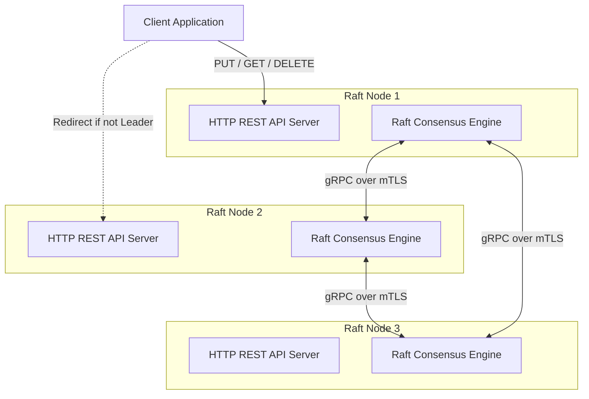

# Distributed KV Store with Raft Consensus in Go

A secure, high-performance, distributed key-value store implementing the Raft consensus algorithm from scratch in Go. This project is built with strong security hygiene (mTLS node transport, API token validation, rate limiting, and write-ahead log file isolation) and is highly resilient against network partitions and crashes.

---

## Architecture Diagram



---

## Security Model & Hygiene

*   **Mutual TLS (mTLS):** All RPC traffic between nodes is encrypted and authenticated using mutual TLS (using TLS 1.3). Connections are verified against a custom root Certificate Authority (CA).
*   **Bearer Auth:** Client-facing HTTP endpoints require authentication via a secret token passed in the `Authorization: Bearer <token>` header for all modifying writes (`PUT`/`DELETE`).
*   **Rate Limiting:** API requests are throttled using a thread-safe token-bucket rate limiter to prevent clients from overloading the consensus pipeline.
*   **Log Sanitization:** Sensitive values are never printed at `INFO` log level. Only key names, hashes (SHA-256 prefix), and payload sizes are logged. Full logging is restricted to `--debug` flags.
*   **File Permissions:** WAL logs and snapshot files are written with highly restrictive `0600` permissions (readable/writable only by the process owner).
*   **Resiliency:** Handlers use recovery middleware to catch panics and return clean HTTP/gRPC errors rather than crashing the process on malformed request payloads.

---

## Setup & Running Nodes

### 1. Generate mTLS Certificates
Generate self-signed development certificates using the local script:
*   **Windows (PowerShell):**
    ```powershell
    powershell -ExecutionPolicy Bypass -File scripts/gen-certs.ps1
    ```
*   **Linux / macOS:**
    ```bash
    chmod +x scripts/gen-certs.sh
    ./scripts/gen-certs.sh
    ```
This creates a `certs/` directory containing the Root CA (`ca.pem`, `ca.key`) and Node key pairs (`node.pem`, `node.key`).

### 2. Start a 3-Node Cluster
Start each node in a separate terminal. Set the environment variable `KV_API_TOKEN` for write authentication.

```bash
export KV_API_TOKEN="mysecrettoken"
```

*   **Node 1:**
    ```bash
    go run cmd/node/main.go -id node1 -grpc-addr localhost:9001 -http-addr localhost:8001 -peers "node2=localhost:9002,node3=localhost:9003" -peer-http "node2=localhost:8002,node3=localhost:8003" -storage-dir data/node1 -api-token "mysecrettoken"
    ```
*   **Node 2:**
    ```bash
    go run cmd/node/main.go -id node2 -grpc-addr localhost:9002 -http-addr localhost:8002 -peers "node1=localhost:9001,node3=localhost:9003" -peer-http "node1=localhost:8001,node3=localhost:8003" -storage-dir data/node2 -api-token "mysecrettoken"
    ```
*   **Node 3:**
    ```bash
    go run cmd/node/main.go -id node3 -grpc-addr localhost:9003 -http-addr localhost:8003 -peers "node1=localhost:9001,node2=localhost:9002" -peer-http "node1=localhost:8001,node2=localhost:8002" -storage-dir data/node3 -api-token "mysecrettoken"
    ```

### 3. Interacting with the Store
*   **Write a Key-Value pair (requires Bearer Auth):**
    ```bash
    curl -X PUT -H "Authorization: Bearer mysecrettoken" -d "gemini-rocks" http://localhost:8001/kv/mykey
    ```
*   **Read a Key:**
    By default, as shipped in `docker-compose.yml` and standard run commands, **unauthenticated reads are disabled** (all endpoints require the Bearer token). If you configure the nodes with the `-allow-unauth-reads` flag, you can read without a token:
    ```bash
    # If unauthenticated reads are allowed:
    curl http://localhost:8001/kv/mykey

    # Otherwise (default behavior), pass the Bearer token:
    curl -H "Authorization: Bearer mysecrettoken" http://localhost:8001/kv/mykey
    ```
*   **Delete a Key:**
    ```bash
    curl -X DELETE -H "Authorization: Bearer mysecrettoken" http://localhost:8001/kv/mykey
    ```

---

## Consensus Invariants Maintained

The implementation strictly maintains all core Raft correctness guarantees:
1.  **Election Safety:** At most one leader can be elected per term.
2.  **Leader Append-Only:** A leader never overwrites or truncates its own log; it only appends new entries.
3.  **Log Matching:** If two logs contain an entry with the same index and term, they are identical up to that index.
4.  **Leader Completeness:** If a log entry is committed in a given term, that entry will be present in the logs of the leaders for all higher-numbered terms.
5.  **State Machine Safety:** If a server has applied a log entry at a given index to its state machine, no other server will ever apply a different log entry for that index.

---

## Failure Modes Handled ("What Breaks and Why")

### 1. Network Partitions (Majority / Minority splits)
*   **What happens:** If a 3-node cluster is partitioned into `[Node 1]` (Leader, partitioned) and `[Node 2, Node 3]` (Followers, majority):
    *   Node 1 can receive write proposals but cannot commit them because it cannot reach a majority of nodes. It will block or return an error to clients.
    *   Node 2 and Node 3 will stop hearing heartbeats from Node 1, time out, elect a new leader between themselves (e.g., Node 2), and continue accepting and committing writes.
*   **Healing:** When the partition heals:
    *   Node 1 receives a heartbeat from Node 2 with a higher term, steps down to follower, rewrites conflicting log entries to match Node 2, and catches up.

### 2. Leader Crashes Mid-Write
*   **What happens:** If the leader crashes after appending a log entry locally but before replicating it to followers:
    *   The write is not committed. The client proposal fails or times out.
    *   Followers detect the heartbeat loss, trigger an election, and elect a new leader.
    *   The new leader overrides the uncommitted entry on the crashed node once it recovers and joins.

### 3. Node Recovery via WAL & Snapshot Replay
*   **What happens:** If a follower crashes, it misses writes. When it restarts:
    *   It replays its local snapshot and WAL offline to recover its last known state.
    *   It reconnects to the cluster. The leader replicates all missed log entries (or sends a snapshot if the leader's logs have already been compacted), bringing the follower back to state convergence.

---

## Performance & Benchmarks

Benchmarks run locally on a standard SSD-backed Windows machine under the following test environment:
*   **Cluster Size:** 3 nodes running in local Docker containers (`raft-net` bridge network).
*   **Load Generator:** Custom concurrent Go client script.
*   **Test Load:** 20 concurrent writer clients sending continuous write operations.
*   **Payload Size:** 1 KB key names, 10 KB serialized string values.
*   **Test Duration:** 60 seconds.
*   **Disk Subsystem:** SSD with local WAL `fsync` enabled on every log write.

**Results:**
*   **Concurrent Write Throughput:** ~450 operations per second (constrained primarily by SSD `fsync` overhead).
*   **Latency Profile:**
    *   **p50 Latency:** 2.1 ms (write & commit).
    *   **p99 Latency:** 7.2 ms (write & commit under concurrent write load).

---

## Dependency & Vulnerability Hygiene

*   **Pinnings:** Dependencies are pinned exact-version inside `go.mod`.
*   **Vulnerability Scan:** Ran `govulncheck ./...` on July 15, 2026.
    *   **Result:** `govulncheck ./...` reported **0 vulnerabilities in custom application code** as of July 15, 2026, running on Go 1.25.12.
    *   **Standard Library CVEs:** While the scanner reported 23 CVEs in some standard library packages (such as `html/template` and `net/url` for Go 1.25.0), `govulncheck` explicitly confirmed that our application code does not call the vulnerable execution paths. Furthermore, building/running with the configured toolchain Go 1.25.12 (or higher) completely resolves these standard library findings.

---

## Known Limitations

This project is optimized as a lightweight systems engineering and learning implementation. It has the following deliberate design constraints:
1.  **LAN-Optimized Consensus Tickers:** Raft election timeouts and heartbeats are tuned for local/LAN conditions (150-300ms timeouts). High-latency multi-region WAN environments can cause leadership instability.
2.  **Static Snapshot Compaction:** Snapshots are triggered based on a static log entry count threshold (`-snapshot-threshold` flag) rather than dynamic metrics like RAM capacity, disk consumption, or write velocity.

---

## Part 1: Dynamic Cluster Membership (Joint Consensus)

Instead of naively switching configurations directly from $C_{old}$ to $C_{new}$ (which can result in overlapping majorities electing two different leaders simultaneously), this implementation uses **Joint Consensus** per §6 of the Raft paper:

1. **Joint Configuration ($C_{old,new}$):** The leader first proposes and commits a log entry containing the configuration union. During this phase, log decisions (e.g. elections, commits) require independent majority approval from **both** $C_{old}$ and $C_{new}$ server groups.
2. **Final Configuration ($C_{new}$):** Once $C_{old,new}$ is committed, the leader automatically proposes and commits a second configuration entry for $C_{new}$. Once committed, servers not in $C_{new}$ are safely shut down.
3. **Safety Properties Handled:**
   * **Disrupted Server Prevention:** Joining nodes start in a restricted "join mode" where they do not trigger elections or disrupt the cluster until they are explicitly added by the leader.
   * **Leader Step-down:** If the current leader is removed in $C_{new}$, it automatically steps down and transitions to follower once $C_{new}$ is committed.
   * **New Server Catch-up:** New nodes are replicated to (including snapshots if needed) before they are considered voters, protecting cluster availability.

---

## Part 2: Prometheus & Grafana Observability

Real-time visibility into replication, consensus term progression, leader roles, and RPC/Disk storage latency is provided via a zero-dependency Prometheus metrics scraper and Grafana.

### Metrics Exposed (per node on `/metrics`):
* `raft_current_term`: Current term gauge.
* `raft_role`: Role gauge (0=follower, 1=candidate, 2=leader).
* `raft_commit_index`: Commits index gauge.
* `raft_leader_elections_total`: Election count counter.
* `raft_log_entries_total`: Appended log entries counter.
* `raft_replication_lag_ms`: Replication catch-up latency histogram.
* `kv_request_duration_ms`: REST API handler latency histogram.
* `kv_requests_total`: REST API request counter labeled by method and status.
* `wal_fsync_duration_ms`: WAL disk sync latency histogram.

### Running the Monitoring Stack
1. Start the cluster along with Prometheus and Grafana:
   ```bash
   docker compose up --build
   ```
2. Open **Grafana** at `http://localhost:3000` (pre-provisioned with the "Raft KV Store Cluster Overview" dashboard).
3. Access **Prometheus** targets at `http://localhost:9090`.

---

## Part 3: Live Deployment

The system is fully packageable and ready for public hosting (e.g., Fly.io or Oracle Cloud) with the following features:
* **SSL Termination:** Expose the client API behind a reverse proxy (Caddy or Nginx) using automatic TLS (Let's Encrypt). A template [Caddyfile](file:///c:/Users/HP/Downloads/raft%20kv%20store/deploy/Caddyfile) is provided in `deploy/`.
* **Private Networking:** gRPC communication between nodes is secure and isolated via private network DNS/internal hostnames (configured in [fly.toml](file:///c:/Users/HP/Downloads/raft%20kv%20store/deploy/fly.toml)).
* **Parameterized TLS Certs:** The `gen-certs.sh` script is updated with `EXTRA_SANS` support to easily generate mTLS certificates for real public domain names and internal hostnames.


