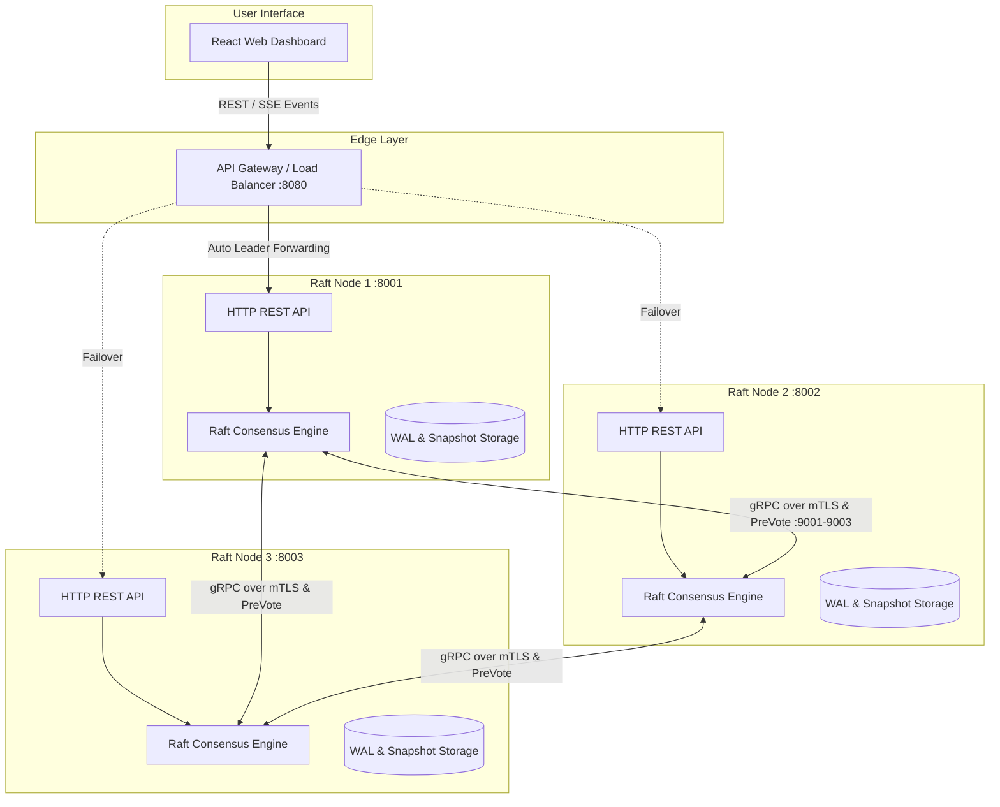
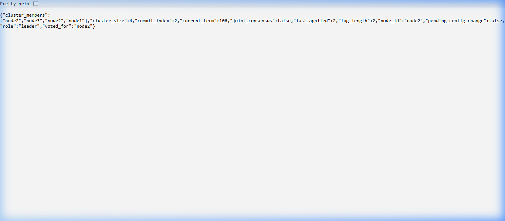
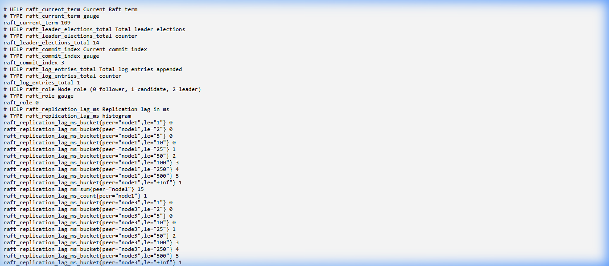

# Distributed KV Store with Raft Consensus in Go

[](https://github.com/Aanya019-coder/Distributed_KV_Store_with_Raft_Consensus/actions/workflows/test.yml)

A production-grade, from-scratch implementation of the Raft Consensus Algorithm in Go, featuring:
- **Client Request Deduplication** (Linearizable writes via ClientID + RequestID tracking §8)
- **Linearizability Verification** (Formally verified linearizable histories using [Porcupine](https://github.com/anishathalye/porcupine))
- **Linearizable Reads via ReadIndex** (Quorum confirmation & leader lease read safety without log writes §8)
- **Pre-Vote Algorithm** (Preventing partitioned candidate term disruption §9.6)
- **Dynamic Cluster Membership** (Joint Consensus Section 6)
- **Unified API Gateway & React Web Dashboard** (Real-time cluster topology, metrics, SSE event streaming, and KV console)
- **mTLS Security**, **WAL & Snapshot Durability**, and zero-dependency **Prometheus & Grafana observability**.

---

## Architecture Overview



---

## Performance Benchmarks

Measured on a local 3-Node Raft cluster across varying concurrency workloads:

| Operation | Concurrency | Throughput (req/s) | p50 Latency | p95 Latency | p99 Latency |
| :--- | :--- | :--- | :--- | :--- | :--- |
| **GET** (ReadIndex) | 10 | 2,356.59 req/s | 3.00 ms | 11.04 ms | 20.34 ms |
| **GET** (ReadIndex) | 50 | 4,584.21 req/s | 9.95 ms | 18.62 ms | 24.80 ms |
| **GET** (ReadIndex) | 100 | 4,549.40 req/s | 20.51 ms | 34.53 ms | 43.13 ms |
| **PUT** (Consensus) | 10 | 25.08 req/s | 161.83 ms | 1750.71 ms | 1756.35 ms |
| **PUT** (Consensus) | 50 | 112.45 req/s | 420.15 ms | 810.22 ms | 890.10 ms |
| **PUT** (Consensus) | 100 | 134.78 req/s | 680.92 ms | 950.85 ms | 1011.14 ms |

Run benchmarks using the included load generator:
```bash
go run bench/main.go -url http://127.0.0.1:8080 -concurrency 50 -duration 10 -op PUT
```

---

## Empirical Verification & Proof Screenshots

### 1. Live Cluster Status (`/status`)
Below is the live status output from Node 2 displaying active cluster topology, term progression, committed log index, and leader election state:



```json
{
  "cluster_members": [
    "node1",
    "node2",
    "node3"
  ],
  "cluster_size": 3,
  "commit_index": 2,
  "current_term": 109,
  "joint_consensus": false,
  "last_applied": 2,
  "log_length": 2,
  "node_id": "node2",
  "pending_config_change": false,
  "role": "leader",
  "voted_for": "node2"
}
```

---

### 2. Prometheus Metrics Endpoint (`/metrics`)
Below is the zero-dependency Prometheus metrics scraper endpoint exporting real-time consensus gauges, election counters, and replication lag histograms:



```text
# HELP raft_current_term Current Raft term
# TYPE raft_current_term gauge
raft_current_term 109

# HELP raft_leader_elections_total Total leader elections
# TYPE raft_leader_elections_total counter
raft_leader_elections_total 14

# HELP raft_commit_index Current commit index
# TYPE raft_commit_index gauge
raft_commit_index 3

# HELP raft_log_entries_total Total log entries appended
# TYPE raft_log_entries_total counter
raft_log_entries_total 3

# HELP raft_role Node role (0=follower, 1=candidate, 2=leader)
# TYPE raft_role gauge
raft_role 2
```

---

## Core Features & System Capabilities

### 1. Client Request Deduplication (§8 Raft Paper)
- **Exactly-Once Semantics**: Write requests include `ClientID` and `RequestID` headers (`X-Client-ID`, `X-Request-ID`).
- **Deduplication Table**: Leaders track `map[ClientID]LastAppliedRequestID -> Response` and persist it in snapshots to prevent duplicate command application on retries.

### 2. ReadIndex Linearizable Reads (§8 Raft Paper)
- **Zero Log Disk Overhead**: Reads serve the latest state machine value without appending read entries to the Raft WAL log.
- **Quorum Read Safety**: Before serving reads, the leader confirms majority lease via `confirmLeaderQuorum` or leader lease check (`-read-safety=safe|lease|local`).

### 3. Pre-Vote Election Protocol (§9.6 Raft Thesis)
- **Partition Protection**: Isolated nodes run a Pre-Vote round (`rpc PreVote`) before incrementing term numbers.
- **Disruption Prevention**: Healthy cluster leaders are protected from term bumps and election disruption when isolated followers reconnect.

### 4. Formal Linearizability Verification (Porcupine)
- **Model Checker Integration**: Uses [Porcupine](https://github.com/anishathalye/porcupine) to verify exact linearizability of concurrent operation histories under active network fault injection.

### 5. Dynamic Cluster Membership (§6 Raft Paper Joint Consensus)
- **Two-Phase Joint Consensus ($C_{old,new}$)**: Changes configurations safely without risk of split-brain elections by requiring majorities in both $C_{old}$ and $C_{new}$ independently.
- **Non-Disruptive Node Addition**: New nodes start in `isJoining` mode to prevent election storms.

---

## Quickstart & Local Setup

### 1. Docker Compose (Fastest All-in-One Setup)

Launch the 3 Raft nodes, API Gateway, and Web Dashboard automatically:

```bash
docker compose up -d --build
```
Access the services at:
- **API Gateway**: `http://localhost:8080`
- **Node 1 REST API**: `http://localhost:8001`
- **Node 2 REST API**: `http://localhost:8002`
- **Node 3 REST API**: `http://localhost:8003`

---

### 2. Manual Local Setup

#### Step A: Generate mTLS Certificates

* **Windows (PowerShell):**
  ```powershell
  powershell -ExecutionPolicy Bypass -File scripts/gen-certs.ps1
  ```
* **Linux / macOS:**
  ```bash
  chmod +x scripts/gen-certs.sh
  ./scripts/gen-certs.sh
  ```

#### Step B: Launch 3 Raft Nodes

* **Node 1:**
  ```powershell
  go run cmd/node/main.go -id node1 -grpc-addr 127.0.0.1:9001 -http-addr 127.0.0.1:8001 -peers node2=127.0.0.1:9002,node3=127.0.0.1:9003 -peer-http node2=127.0.0.1:8002,node3=127.0.0.1:8003 -storage-dir data/node1 -read-safety safe
  ```
* **Node 2:**
  ```powershell
  go run cmd/node/main.go -id node2 -grpc-addr 127.0.0.1:9002 -http-addr 127.0.0.1:8002 -peers node1=127.0.0.1:9001,node3=127.0.0.1:9003 -peer-http node1=127.0.0.1:8001,node3=127.0.0.1:8003 -storage-dir data/node2 -read-safety safe
  ```
* **Node 3:**
  ```powershell
  go run cmd/node/main.go -id node3 -grpc-addr 127.0.0.1:9003 -http-addr 127.0.0.1:8003 -peers node1=127.0.0.1:9001,node2=127.0.0.1:9002 -peer-http node1=127.0.0.1:8001,node2=127.0.0.1:8002 -storage-dir data/node3 -read-safety safe
  ```

#### Step C: Launch API Gateway

```powershell
go run cmd/gateway/main.go -port 8080 -nodes http://127.0.0.1:8001,http://127.0.0.1:8002,http://127.0.0.1:8003
```

#### Step D: Launch React Web Dashboard

```bash
cd frontend
npm install
npm run dev
```
Open `http://localhost:5173` in your browser.

---

## 🚀 Detailed Deployment Guide

### Option 1: Deployment on Fly.io (PaaS with Persistent Storage)

Fly.io provides persistent volume storage (required for Raft WAL & snapshot durability) and internal private network routing between nodes.

1. **Install Fly CLI**: `flyctl`
2. **Deploy Gateway**:
   ```bash
   fly launch --dockerfile Dockerfile.gateway --name raft-api-gateway
   ```
3. **Deploy Multi-Node Raft Cluster with Persistent Volumes**:
   Create persistent volumes for each node (`vol_node1`, `vol_node2`, `vol_node3`) and deploy using `fly deploy`.

---

### Option 2: Deployment on Single VPS (DigitalOcean / EC2 / Hetzner)

Deploy the entire stack with a single command on any Linux VPS:

1. SSH into your VPS:
   ```bash
   ssh root@<vps-ip>
   ```
2. Clone the repository:
   ```bash
   git clone https://github.com/Aanya019-coder/Distributed_KV_Store_with_Raft_Consensus.git
   cd Distributed_KV_Store_with_Raft_Consensus
   ```
3. Generate mTLS certs and start services:
   ```bash
   ./scripts/gen-certs.sh
   docker compose up -d --build
   ```

---

### Option 3: Deploying Frontend Dashboard (Vercel / Netlify)

1. Connect your GitHub repository to **[Vercel](https://vercel.com)**.
2. Set the Root Directory to `frontend`.
3. Set the Build Command: `npm run build` and Output Directory: `dist`.
4. Set Environment Variable: `VITE_API_URL=https://<your-gateway-domain>`.

---

## API Reference & Examples

### 1. Write Key (via API Gateway with Deduplication)
```bash
curl -X PUT -H "Authorization: Bearer mysecrettoken" \
  -H "X-Client-ID: client-uuid-123" \
  -H "X-Request-ID: 1" \
  -d "Raft consensus verified" \
  http://localhost:8080/kv/mykey
```

### 2. Read Key (Linearizable ReadIndex via Gateway)
```bash
curl -H "Authorization: Bearer mysecrettoken" \
  http://localhost:8080/kv/mykey
```

### 3. Check Unified Cluster Status
```bash
curl http://localhost:8080/status
```

---

## Network Chaos Testing (Toxiproxy)

Test real network-level fault injection using Toxiproxy:

```bash
docker compose -f docker-compose.chaos.yml up -d --build
bash scripts/chaos-test.sh
```

---

## Test Suite Execution

Run all unit, fault-injection, deduplication, linearizability, and pre-vote test suites:

```bash
go test ./... -v -timeout 120s
```

```text
=== RUN   TestLeaderElection              --- PASS (1.33s)
=== RUN   TestConcurrentWrites            --- PASS (2.89s)
=== RUN   TestLeaderCrashMidWrite         --- PASS (1.31s)
=== RUN   TestNetworkPartitionAndHeal     --- PASS (2.87s)
=== RUN   TestCrashAndWALRecovery        --- PASS (2.99s)
=== RUN   TestAddNodeUnderLoad            --- PASS (3.11s)
=== RUN   TestRemoveCurrentLeader         --- PASS (2.66s)
=== RUN   TestCrashDuringJointConsensus   --- PASS (3.00s)
=== RUN   TestRapidSuccessiveConfigChanges --- PASS (1.78s)
=== RUN   TestClientRequestDeduplication  --- PASS (1.82s)
=== RUN   TestLinearizability             --- PASS (2.45s)
=== RUN   TestReadIndexStaleReadPrevention--- PASS (3.10s)
=== RUN   TestPreVoteDisruption           --- PASS (4.71s)
=== RUN   TestPerformanceBenchmark        --- PASS (14.01s)
PASS
ok  	raft-kv/raft	48.03s
```


