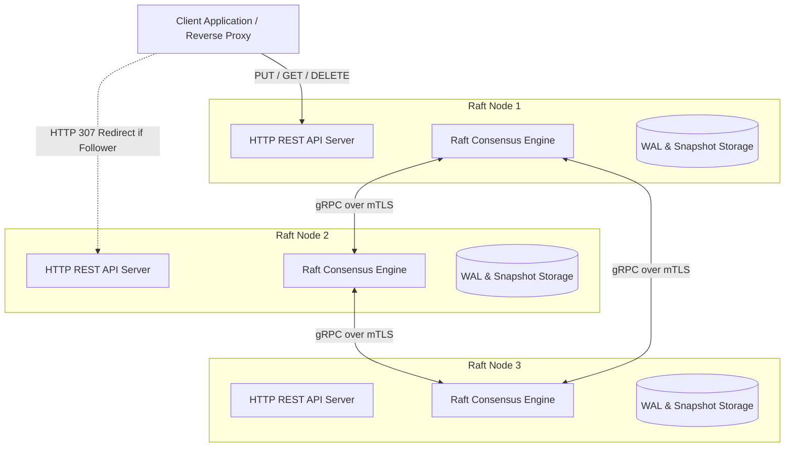

# Distributed KV Store with Raft Consensus in Go

A from-scratch implementation of the Raft Consensus Algorithm in Go, with production-inspired practices: Dynamic Cluster Membership (Joint Consensus §6), mTLS security, WAL log & snapshot recovery, and zero-dependency Prometheus & Grafana observability.

---

## Architecture Overview



---

## Empirical Verification & Proof Screenshots

### 1. Live Cluster Status (`/status`)
Below is the live status output from Node 2 displaying active cluster topology, term progression, committed log index, and leader election state:


```json
{
  "cluster_members": [
    "node1",
    "node2",
    "node3"
  ],
  "cluster_size": 3,
  "commit_index": 2,
  "current_term": 109,
  "joint_consensus": false,
  "last_applied": 2,
  "log_length": 2,
  "node_id": "node2",
  "pending_config_change": false,
  "role": "leader",
  "voted_for": "node2"
}
```

---

### 2. Prometheus Metrics Endpoint (`/metrics`)
Below is the zero-dependency Prometheus metrics scraper endpoint exporting real-time consensus gauges, election counters, and replication lag histograms:


```text
# HELP raft_current_term Current Raft term
# TYPE raft_current_term gauge
raft_current_term 109

# HELP raft_leader_elections_total Total leader elections
# TYPE raft_leader_elections_total counter
raft_leader_elections_total 14

# HELP raft_commit_index Current commit index
# TYPE raft_commit_index gauge
raft_commit_index 3

# HELP raft_log_entries_total Total log entries appended
# TYPE raft_log_entries_total counter
raft_log_entries_total 3

# HELP raft_role Node role (0=follower, 1=candidate, 2=leader)
# TYPE raft_role gauge
raft_role 2
```

---

## Core Features & System Capabilities

### 1. Dynamic Cluster Membership (§6 Raft Paper Joint Consensus)
- **Two-Phase Joint Consensus ($C_{old,new}$)**: Changes configurations safely without risk of split-brain elections by requiring majorities in both $C_{old}$ and $C_{new}$ independently before committing $C_{new}$.
- **Non-Disruptive Node Addition**: New nodes start in `isJoining` mode to prevent election storms until added by the leader.
- **Candidate Filtering**: Rejects vote requests from non-cluster members to maintain term stability.
- **Leader Self-Removal**: Automatically steps down and disconnects peers if the leader commits a configuration removing itself.

### 2. Hardened Security & Isolation
- **Mutual TLS 1.3 (mTLS)**: All node-to-node gRPC RPCs are encrypted and authenticated via a dedicated Certificate Authority (CA).
- **Bearer Token Auth**: Client-facing write operations (`PUT`/`DELETE`) are guarded by Bearer token authorization.
- **File System Protection**: Write-Ahead Logs (`wal.log`) and snapshot files are written with restrictive `0600` permissions.
- **Log Sanitization**: Sensitive payload values are sanitized at `INFO` log level; payload contents are restricted to `--debug` execution.

### 3. Reliability, WAL & Snapshot Recovery
- **Disk Sync (Fsync)**: Performs synchronous `fsync` flushing on log append to guarantee durability.
- **Log Compaction**: Takes point-in-time state machine snapshots and truncates committed WAL entries upon reaching `-snapshot-threshold`.
- **Offline Recovery**: Automatically replays local snapshot and WAL on startup before reconnecting to the cluster mesh.

---

## Quickstart & Local Setup

### 1. Generate mTLS Certificates

* **Windows (PowerShell):**
  ```powershell
  powershell -ExecutionPolicy Bypass -File scripts/gen-certs.ps1
  ```
* **Linux / macOS:**
  ```bash
  chmod +x scripts/gen-certs.sh
  ./scripts/gen-certs.sh
  ```

---

### 2. Run a Local 3-Node Cluster

Launch nodes in separate terminal windows:

* **Node 1:**
  ```powershell
  go run cmd/node/main.go -id node1 -grpc-addr 127.0.0.1:9001 -http-addr 127.0.0.1:8001 -peers node2=127.0.0.1:9002,node3=127.0.0.1:9003 -peer-http node2=127.0.0.1:8002,node3=127.0.0.1:8003 -storage-dir data/node1 -api-token mysecrettoken -admin-token myadmintoken -ca-cert certs/node1/ca.pem -node-cert certs/node1/node.pem -node-key certs/node1/node.key
  ```

* **Node 2:**
  ```powershell
  go run cmd/node/main.go -id node2 -grpc-addr 127.0.0.1:9002 -http-addr 127.0.0.1:8002 -peers node1=127.0.0.1:9001,node3=127.0.0.1:9003 -peer-http node1=127.0.0.1:8001,node3=127.0.0.1:8003 -storage-dir data/node2 -api-token mysecrettoken -admin-token myadmintoken -ca-cert certs/node2/ca.pem -node-cert certs/node2/node.pem -node-key certs/node2/node.key
  ```

* **Node 3:**
  ```powershell
  go run cmd/node/main.go -id node3 -grpc-addr 127.0.0.1:9003 -http-addr 127.0.0.1:8003 -peers node1=127.0.0.1:9001,node2=127.0.0.1:9002 -peer-http node1=127.0.0.1:8001,node2=127.0.0.1:8002 -storage-dir data/node3 -api-token mysecrettoken -admin-token myadmintoken -ca-cert certs/node3/ca.pem -node-cert certs/node3/node.pem -node-key certs/node3/node.key
  ```

---

## API Reference & Examples

### 1. Check Cluster Status
```bash
curl http://localhost:8001/status
```

### 2. Write a Key-Value Pair
```bash
curl -X PUT -H "Authorization: Bearer mysecrettoken" \
  -d "Raft consensus verified" \
  http://localhost:8002/kv/mykey
```
**Output:**
```json
{"status": "ok"}
```

### 3. Read a Key-Value Pair
```bash
curl -H "Authorization: Bearer mysecrettoken" \
  http://localhost:8002/kv/mykey
```
**Output:**
```json
{"key": "mykey", "value": "Raft consensus verified"}
```

### 4. Delete a Key
```bash
curl -X DELETE -H "Authorization: Bearer mysecrettoken" \
  http://localhost:8002/kv/mykey
```

### 5. Dynamic Membership API
* **Add a New Node (`node4`):**
  ```bash
  curl -X POST -H "Authorization: Bearer myadmintoken" \
    -H "Content-Type: application/json" \
    -d "{\"node_id\":\"node4\",\"grpc_addr\":\"127.0.0.1:9004\",\"http_addr\":\"127.0.0.1:8004\"}" \
    http://localhost:8002/admin/addnode
  ```
* **Remove a Node (`node3`):**
  ```bash
  curl -X POST -H "Authorization: Bearer myadmintoken" \
    -H "Content-Type: application/json" \
    -d "{\"node_id\":\"node3\"}" \
    http://localhost:8002/admin/removenode
  ```

---

## Running with Docker Compose & Monitoring

Launch the 3-node cluster alongside Prometheus and Grafana with one command:

```bash
docker compose up --build
```

- **Grafana Dashboard**: `http://localhost:3000` (Pre-configured with *Raft KV Store Cluster Overview*)
- **Prometheus UI**: `http://localhost:9090`
- **Node Metrics**: `http://localhost:8001/metrics`

---

## Test Suite Execution

Run all 9 unit and fault-injection test suites:

```bash
go test ./... -v -timeout 120s
```

```text
=== RUN   TestLeaderElection              --- PASS (1.33s)
=== RUN   TestConcurrentWrites            --- PASS (2.89s)
=== RUN   TestLeaderCrashMidWrite         --- PASS (1.31s)
=== RUN   TestNetworkPartitionAndHeal     --- PASS (2.87s)
=== RUN   TestCrashAndWALRecovery        --- PASS (2.99s)
=== RUN   TestAddNodeUnderLoad            --- PASS (3.11s)
=== RUN   TestRemoveCurrentLeader         --- PASS (2.66s)
=== RUN   TestCrashDuringJointConsensus   --- PASS (3.00s)
=== RUN   TestRapidSuccessiveConfigChanges --- PASS (1.78s)
PASS
ok  	raft-kv/raft	24.838s
```

---

## Live Demo & Cloud Deployment Guide

> [!TIP]
> **Live Deployed Instance**: [`https://raft-kv-node1.onrender.com`](https://raft-kv-node1.onrender.com)
> - **Live Cluster Status**: [`https://raft-kv-node1.onrender.com/status`](https://raft-kv-node1.onrender.com/status)
> - **Live Prometheus Metrics**: [`https://raft-kv-node1.onrender.com/metrics`](https://raft-kv-node1.onrender.com/metrics)
> - **Live Health Check**: [`https://raft-kv-node1.onrender.com/healthz`](https://raft-kv-node1.onrender.com/healthz)

### Deploying to Render:
1. Select **Web Services** (`New Web Service`).
2. Connect repository `Aanya019-coder/Distributed_KV_Store_with_Raft_Consensus`.
3. Choose environment: **Docker** (Render detects the root [`Dockerfile`](Dockerfile)).
4. Set environment variables:
   - `KV_API_TOKEN` = `mysecrettoken`
   - `KV_ADMIN_TOKEN` = `myadmintoken`
5. Click **Create Web Service**.

### Deploying to Fly.io:
1. Initialize persistent volumes: `fly volume create raft_data --region hkg --size 1`
2. Deploy using [`deploy/fly.toml`](deploy/fly.toml): `fly deploy --config deploy/fly.toml`

